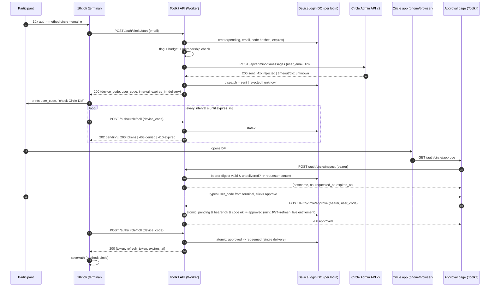

# Architecture Review: Circle private-message login for 10x-cli

> Status: **review package for the user's decision. Nothing here is approved.**
> Written 2026-09-13 by Session B at the `/10x-plan` decision checkpoint, from
> [frame.md](frame.md) and [research.md](research.md). The draft outline at the
> end is **UNAPPROVED** and exists only to make the alternatives concrete.
> Implementation, live Circle messages, deployments and merges are not authorized.

## 1. Problem and non-negotiables

Problem (from the frame): a participant whose mailbox is unreachable needs a
way to prove, through the Circle account they already hold, that *this*
terminal may receive Toolkit CLI credentials, without the proof itself granting
or restoring any course access.

Constraints every design below satisfies (rejected otherwise):

- Email login stays as-is; released CLI 1.20.0 keeps working unchanged.
- The credential is the existing Toolkit HS256 JWT plus family-rotated refresh
  token; refresh, revocation, `/api/me/courses`, module unlocks and explicit
  project edition selection are untouched.
- Circle identity proof never creates or resurrects grants; entitlement is
  re-read from `CLI_10X3_MEMBERSHIP_KV` at approval and at token issuance.
- Circle credentials stay server-side; no bearer, recipient or message body in logs.
- DM outcome classification follows EDU: 4xx = rejected, timeout/5xx = unknown,
  never auto-resent, never silently switched to email.
- One-time state (dispatch, approval, redemption) has real atomicity evidence,
  not KV get-then-delete.
- No EDU cookie, no request identifier alone, no arbitrary callback URL.

## 2. What the three repos give us (settled facts)

| Capability | CLI | Toolkit | EDU |
| --- | --- | --- | --- |
| DM transport to Circle | none | none (roster read/delete only) | yes, Admin v2 `POST /messages` |
| Atomic one-time store | n/a | none (KV only) | Postgres RPCs with row locks |
| CLI credential issuance | consumer | yes (JWT + refresh families) | none |
| Entitlement source | none cached | `activeRegisteredCourseIds` over KV | reads Toolkit KV read-only |
| Rate limits / flags | n/a | KV soft counter; env tri-state precedent | Postgres budgets; `system_flags` + pilot hashes |
| Browser approval page | none | callback HTML only | fragment page, auto inspect→confirm |
| S2S trust between EDU and Toolkit | n/a | none | none |

## 3. Candidate designs

### Design A — Toolkit-owned device-style Circle login (recommended)

Toolkit gains a second login channel modelled on RFC 8628. The CLI receives a
secret `device_code` (never displayed) and a short `user_code` (displayed).
Toolkit sends one Circle DM containing a link whose fragment carries a
256-bit link bearer. The link opens a Toolkit-hosted approval page that shows
requester context and asks the human to **type the user_code from the
terminal**, then POSTs approval. The CLI polls with `device_code` and receives
the normal JWT/refresh pair. All state lives in a Durable Object per pending
login; budgets live in a Durable Object per subject.

Why two proofs: the link bearer proves "this Circle account received the DM"
(identity); the typed terminal code proves "the approver is looking at the
terminal that asked" (binding). Either alone is insufficient: a link alone is
the RFC 8628 §5.4 remote-phishing case, a code alone proves nothing about
Circle.

Affected repositories: Toolkit (routes, service, DO classes, wrangler bindings
and migration, secrets, OpenAPI), CLI (`auth --method`, polling, config field,
docs, generated types), EDU none (optional docs pointer).

Tradeoffs:
- Plus: Toolkit remains the single auth authority; no new cross-service trust;
  works from SSH, devcontainers and phones because nothing listens locally;
  additive contracts only; EDU's transport, crypto and policy modules port
  nearly verbatim.
- Minus: Toolkit must add its first Durable Object (new binding, migration,
  test harness work); the approval page is a new browser surface on Toolkit;
  a separate Circle v2 messaging token must be provisioned and verified
  (not authorized by this goal); the user types a code, one extra step versus
  EDU's auto-confirm.

Variant A1 (weaker binding): the page displays the code and the human only
*compares* it with the terminal (Stripe style). Fewer keystrokes, but a hurried
user can approve an attacker's request. Not recommended for a flow whose
whole point is identity recovery.

### Design B — EDU identity bridge

EDU's existing Circle login (Postgres RPCs, transport, budgets, flags, pilot)
is reused as the identity proof. The CLI starts a device login on Toolkit,
Toolkit returns a `user_code`, and the DM link opens EDU's confirmation page in
a new "CLI approval" mode. After EDU's normal inspect/confirm, EDU calls a new
server-to-server Toolkit endpoint with a signed assertion (`email`,
`user_code`, `nonce`, `exp`) under a new shared secret or key pair. Toolkit
verifies the assertion, re-checks entitlement, marks the device login approved
and the CLI collects tokens as in A.

Affected repositories: all three. EDU (new confirmation mode, S2S client,
secret), Toolkit (device endpoints, assertion verifier, DO or KV state for the
device login, secret), CLI (same as A).

Tradeoffs:
- Plus: reuses proven atomic SQL, transport, budgets, timing neutrality and
  the pilot mechanism; one Circle token set (EDU's) instead of two.
- Minus: introduces a hidden runtime dependency: EDU outage or Supabase
  outage blocks CLI login; a new cross-repo trust contract (signing key,
  rotation, replay window) that nothing today provides; EDU's identity is a
  browser-session identity and its auto-confirm UX would still need the typed
  terminal code, so EDU's page changes anyway; Toolkit still needs its own
  atomic store for the device login, so the "reuse Postgres" benefit is
  partial; three coordinated deploys; contradicts the recorded direction that
  Toolkit is the access authority and EDU is a consumer.

### Design C — Toolkit-owned loopback authorization with state and PKCE

The CLI opens a browser to a Toolkit login page with `state` and a PKCE
`code_challenge`; the page offers email or Circle DM; the DM link returns the
user to the page; on success the page redirects to `http://127.0.0.1:{port}`
with an authorization code; the CLI exchanges code plus `code_verifier` for
tokens.

Affected repositories: Toolkit (authorize/token endpoints, chooser page, DO
state), CLI (`node:http` listener, browser opener, PKCE).

Tradeoffs:
- Plus: standard native-app protocol; strongest same-browser binding; a
  natural place for a method chooser and future providers.
- Minus: fails exactly where this feature is needed most: the DM is usually
  read on a phone or the CLI runs over SSH, so the loopback redirect lands on a
  machine with no listener; every surveyed loopback CLI adds a device or
  copy-paste fallback, so C implies building A anyway; new listener and
  browser-opening code in the CLI; larger attack surface (open redirect,
  port hijack) for no gain in the target scenario.

### Comparison

| Criterion | A (device, Toolkit) | B (EDU bridge) | C (loopback + PKCE) |
| --- | --- | --- | --- |
| Works on phone / SSH / devcontainer | yes | yes | no without A-style fallback |
| New cross-service trust | none | new signed assertion + secret | none |
| Atomic store needed in Toolkit | DO (new) | DO or KV (new) plus EDU Postgres | DO (new) |
| Circle token ownership | Toolkit (new secret) | EDU (existing) | Toolkit (new secret) |
| Repos changed | 2 | 3 | 2 |
| Failure coupling | Circle + Toolkit | Circle + EDU + Supabase + Toolkit | Circle + Toolkit |
| Binding strength | typed code + link bearer | same, via EDU | PKCE same-browser (n/a cross-device) |
| Reuse of EDU code | port modules | runtime reuse | port modules |
| Recommendation | **recommended** | not recommended | not recommended as primary |

## 4. Recommendation

Design A with the typed terminal code. It is the only design that satisfies
the constraints without new cross-service trust and that works in the
phone-plus-terminal situation the feature exists for. EDU's contribution is
code and policy to port, not a runtime dependency. Design C can be added later
as an accelerator if a browser-first UX is wanted; Design B should be revisited
only if the user prefers a single Circle token set and accepts the EDU/Supabase
dependency in the CLI login path.

## 5. Sequence diagram (Design A)



## 6. Trust boundaries (Design A)

```mermaid
flowchart LR
    subgraph T1[Terminal - untrusted network position]
        CLI[10x-cli\nholds device_code + user_code\nstores JWT/refresh 0600]
    end
    subgraph T2[Toolkit Worker - trusted]
        API[/auth/circle/* routes]
        DO[(DeviceLogin DO\nSQLite, single instance)]
        BUD[(AuthBudget DO\nper subject)]
        KV[(CLI_10X3_MEMBERSHIP_KV\nlive entitlement)]
        SEC[secrets: JWT_SECRET,\nCIRCLE_*_V2_TOKEN]
    end
    subgraph T3[Circle - third party]
        CAPI[Admin API v2 /messages]
        DM[Participant's DM inbox]
    end
    subgraph T4[Approver's browser - untrusted]
        PAGE[Approval page\nbearer in fragment only\nPOST inspect/approve]
    end
    CLI -- start/poll (device_code) --> API
    API -- one DM, no retry --> CAPI --> DM
    DM -- link#bearer --> PAGE
    PAGE -- inspect/approve (bearer + user_code) --> API
    API <--> DO
    API <--> BUD
    API -- read only --> KV
    API -. never leaves T2 .-> SEC
```

Boundary rules:
- `device_code` never leaves the terminal↔API channel; it is not in the DM,
  the page or the logs.
- The link bearer never reaches the API on a GET (fragment only) and is
  scrubbed from history by the page script, as in EDU.
- `user_code` is the only value that crosses from T1 to T4, by human action.
- The approval page has no cookie session; it is a static page whose POSTs
  carry the bearer. `Origin` must equal the Toolkit site origin, `no-store`
  and `no-referrer` headers as in EDU.
- The Circle token and JWT secret are Worker secrets; the CLI never sees them.
- KV is read for entitlement at approval and at token mint; it is never
  written by this flow.

## 7. Proposed contracts (draft, for review)

### 7.1 Toolkit HTTP (additive; existing `/auth/*` untouched)

| Endpoint | Request | Responses | Notes |
| --- | --- | --- | --- |
| `POST /auth/circle/start` | `{ email, client?: { hostname?, os? } }` | `200 { device_code, user_code, expires_in: 900, interval: 5, delivery: "sent" \| "unknown" }`; `403 no_access`; `429 rate_limited`; `502 dm_rejected`; `503 circle_login_disabled` | Whether `403` is returned or a neutral `200` is decision D5. `delivery: "unknown"` means timeout/5xx: the message may have been sent. |
| `POST /auth/circle/poll` | `{ device_code }` | `200 { token, refresh_token, expires_at }`; `202 { status: "pending" \| "dispatched" }`; `400 slow_down`; `403 access_denied`; `410 expired` | Single delivery: first successful 200 flips `approved → redeemed`. |
| `POST /auth/circle/inspect` | `{ bearer }` | `200 { requested_at, expires_at, client: {hostname?, os?}, ip_hint? }`; `410 expired_or_used` | Does not consume. Rate-limited per IP. |
| `POST /auth/circle/approve` | `{ bearer, user_code }` | `200 { approved: true }`; `400 code_mismatch` (bounded attempts); `403 no_access`; `410 expired_or_used` | Consumes the bearer on success; on `no_access` marks the login denied without minting. |
| `GET /auth/circle/approve` | — | static HTML | Page script reads the fragment, POSTs inspect then waits for the human. |

Error codes must join `ERROR_CODE_MESSAGES` in the CLI and the pinned log
taxonomy in Toolkit (`event`, `ts`, `latency_ms`, `reason`, `email_hash`).

### 7.2 Toolkit state (Durable Objects)

`DeviceLogin` DO, id derived from a random login id; SQLite rows:
`state ∈ pending | dispatched | approved | redeemed | denied | expired`,
`email_hash`, `device_code_hash`, `user_code_hash`, `bearer_hash`,
`dispatch ∈ none | sent | rejected | unknown`, `code_attempts`,
`jwt`, `refresh_token` (only between approved and redeemed),
`requested_at`, `expires_at`, `client` json. Every transition is one
synchronous storage transaction; `alarm()` expires and purges.

`AuthBudget` DO per subject (`account:<email_hash>`, `community:<id>`,
`admission:<ip_hmac>`), windows quarter-hour/hour/day/month, thresholds
ported from EDU `policy.ts` as starting values (decision D7 sets ownership).

Bindings and secrets to add in `wrangler.toml`: `DEVICE_LOGIN` and
`AUTH_BUDGET` DO namespaces with a `new_sqlite_classes` migration;
`CIRCLE_BRAVE_V2_TOKEN` (and per-community tokens if needed);
`AUTH_CIRCLE_LOGIN = disabled | pilot | enabled`; `AUTH_CIRCLE_PILOT_EMAIL_HASHES`.

### 7.3 CLI

- `10x auth --method email|circle` (default `email`); in TTY without the flag,
  behaviour per decision D6. Non-TTY/JSON never prompts and requires
  `--email` and, for Circle, an explicit `--method circle`.
- Progress copy prints the `user_code` and "Open the Circle message and enter
  this code"; JSON envelope on success stays `{ authenticated, email, expires_at }`
  plus optional `method`.
- `AuthData` gains optional `method?: "email" | "circle"` at file version 1;
  the refresh rotation constructor copies it.
- Polling reuses `pollVerifySession` seams with `interval` from the server,
  honours `slow_down`, and wires SIGINT to an `AbortController` so Ctrl-C
  yields `auth_cancelled`.
- Ambiguous delivery: the CLI keeps polling for the full window and, on
  expiry, prints a hint offering `10x auth --method email` or a fresh Circle
  request; it never resends by itself.
- Generated types regenerated from the candidate Toolkit spec and committed in
  the CLI PR; README and `skills/10x-cli-guide` gain a "no email received" row.

### 7.4 Circle transport (port of EDU `transport.ts`)

Same endpoint, `redirect: 'manual'`, 5 s abort, fixed rich-text body with
the approval link and a 15-minute notice, no retry. Outcome enum only in
logs. Header form (`Token` vs `Bearer`) confirmed during the authorized live
verification, not assumed.

## 8. Cost of failure

- **DM rejected (4xx)**: login marked `denied`, CLI gets `dm_rejected` with an
  email fallback hint. No credential risk.
- **DM unknown (timeout/5xx)**: login stays `dispatched`; the message may
  arrive; the CLI waits the full window; the user chooses what to do next.
  Risk is a stale request, not a duplicate send.
- **Bearer leaked (forwarded DM, scanner)**: the holder can inspect but
  cannot approve without the terminal's `user_code`; attempts are bounded and
  budgeted. Residual risk: a JS-capable scanner learns requester context only.
- **`user_code` guessed**: about 34 bits, 5 attempts per login, per-IP budget;
  the attacker also needs the bearer. Negligible.
- **`device_code` stolen from the terminal**: same exposure as today's session
  ID, but 256-bit and never transmitted outside the terminal↔API channel.
- **Circle outage**: Circle login unavailable; email login unaffected; the
  flag can disable the channel without deploy.
- **DO unavailable**: Circle login fails closed; email login unaffected (KV path).
- **Entitlement revoked between start and approval**: approval re-reads KV
  and denies; nothing minted. Revoked after mint: existing refresh 403 path.

## 9. Verification and rollout scope (for the plan, not yet approved)

Automated (Toolkit): DO state machine tests under workerd (`wrangler.unstable_dev`
harness already exists) covering concurrent approve/poll, double redemption,
expiry alarm, code attempts, budget windows; transport tests with injected
fetch for sent/rejected/unknown; route tests for CSRF-equivalent origin checks,
log shape and PII guard; released-CLI compatibility suite unchanged and green.

Automated (CLI): `auth-flow` unit tests for start/poll with `slow_down`,
expiry and abort; command-level exit-code and JSON-envelope cases; auth-file
round-trip with `method`; generated-types `--check` against the candidate
spec; smoke startup budget.

Coordinated E2E (private Toolkit): a `app.circle.so` fetch intercept fixture
beside the Resend intercept, exposing the last DM at `/__fixture/dm`, so the
full start → DM → approve → poll → refresh path runs on Linux and Windows
without live messages. Public CI receives the receipt only.

Manual (separately authorized): one live DM to a pilot account to confirm
token permission, header form, sender identity and self-message behaviour;
phone-plus-SSH walkthrough; v3-only, v4-only, both, none, refunded accounts.

Rollout: Toolkit deploy with DO migration and `AUTH_CIRCLE_LOGIN=disabled`
→ CLI release with `--method circle` (fails with `circle_login_disabled`
until enabled) → `pilot` with hashes → `enabled`. Rollback is the flag; the
DO namespace can stay. No EDU deploy.

## 10. Decisions for the user

Grouped so related choices can be answered together. Recommendations are
mine; none is applied.

**D1 Ownership** — A: Toolkit-owned Circle auth (recommended) · B: EDU identity
bridge with a new S2S assertion contract. Why it matters: failure coupling,
number of repos, and whether a new cross-service trust exists.

**D2 Terminal binding** — typed `user_code` on the approval page
(recommended) · compare-only code · loopback + PKCE (Design C) · DM link
only (rejected: remote-phishing exposure). Why: this is the security property
that distinguishes the CLI flow from EDU's.

**D3 Atomic store** — Durable Object SQLite per login (recommended) · D1
with conditional updates · EDU Postgres via bridge (implies D1=B) · KV
(rejected). Why: first DO in Toolkit is real operational scope.

**D4 Entitlement at login** — require at least one active registered course at
start and re-check at approval, as email login does (recommended) · identity-only
login with empty `courses` (matches the superseded broker plan, changes
`/auth/circle/start` semantics). Why: consistency with current 403 behaviour.

**D5 Enumeration posture** — explicit `403 no_access` at start, matching email
login (recommended for consistency) · neutral `200` with `delivery: "unknown"`
for non-members, matching EDU. Why: support clarity versus membership
enumeration; email login is enumerable today.

**D6 CLI method UX** — `--method` flag with email default and a TTY select
only when no flag is given (recommended) · flag only, no chooser · offer
Circle after an email failure or timeout (explicit choice, never automatic).
Why: backward compatibility, headless use and support burden.

**D7 Rate-limit, flag and credential ownership** — Toolkit owns budgets in
DO, tri-state env flag plus pilot hashes, and a separate Brave v2 messaging
token secret (recommended) · reuse `CIRCLE_API_TOKEN` if the live check
proves it can message. Why: blast radius and who rotates what.

**D8 Email-path hardening** — leave the existing `/auth/verify` flow untouched
in this change, but never reuse it for Circle (recommended) · add a poll
secret and POST-confirm to the email path in the same change. Why: scope and
release risk versus fixing a known weakness while the area is open.

**D9 Live verification** — authorize one supervised pilot DM before the plan
is finalized (recommended, separate explicit approval) · plan against
documented behaviour and verify during implementation. Why: token permission
and header form are unverified; a wrong assumption invalidates the transport
phase.

**D10 EDU involvement** — none beyond a docs pointer (recommended under A) ·
extract a shared transport/policy package for both apps · full bridge (B).

## 11. Draft implementation outline — UNAPPROVED

> This outline assumes Design A with the recommended answers above. It is a
> sketch to size the work; `/10x-plan` will rebuild it from the user's actual
> decisions. It carries no Progress section on purpose.

1. **Toolkit: state and policy** — `DeviceLogin` and `AuthBudget` DOs, wrangler
   bindings and migration, policy constants, crypto helpers ported from EDU;
   workerd tests for atomic transitions and budgets.
2. **Toolkit: transport and flags** — Circle messaging client with injected
   fetch, outcome enum, secrets, `AUTH_CIRCLE_LOGIN` tri-state and pilot hashes.
3. **Toolkit: routes and page** — `start`, `poll`, `inspect`, `approve` routes
   with Zod schemas (OpenAPI grows additively), static approval page, log-shape
   and PII tests, released-CLI compatibility suite green.
4. **CLI: method and polling** — `--method`, start/poll client, `user_code`
   display, SIGINT abort, `AuthData.method`, error-code copy, regenerated types.
5. **CLI: UX, docs and fallback copy** — TTY chooser per D6, ambiguous-delivery
   hints, README and guide rows, JSON envelope cases.
6. **Coordinated evidence** — DM sink fixture in private Toolkit E2E, Linux and
   Windows runs, receipt verification in public CI.
7. **Pilot and rollout** — deploy disabled, enable pilot hashes, supervised
   live walkthrough, enable for Brave, monitoring reasons added to the runbook.

Contracts to register with `/10x-contract` once accepted: the four Toolkit
endpoints and their error codes, the `AuthData.method` field, the DO state
enum, the flag names. Lessons to consider with `/10x-lesson`: "a link-only
approval is not a terminal binding" and "4xx closes, everything else is
unknown and never resent".

## 12. What this package does not claim

- No security audit was performed; the threat notes are design reasoning.
- Circle's messaging permission for any Toolkit token, the header form, sender
  identity and self-message behaviour are unverified.
- The CLI-specific count of affected participants is unknown.
- No plan.md exists; `change.md` stays `preparing`.
