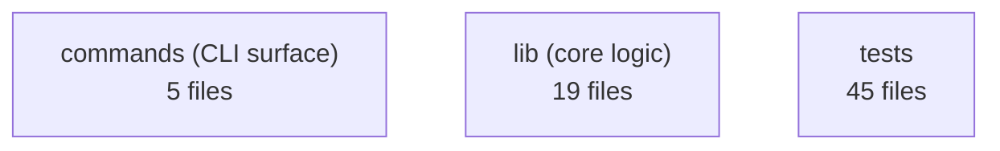

# Repo Map — 10x-cli

<!-- GENERATED by tools/repo-map/scan.mjs — do not hand-edit. Run `npm run repo-map`. -->

> Scan of `0567d0b` (2026-07-27) · window: last 12 months · engine: tools/repo-map
>
> Operational map of the territory, built from cheap deterministic signals (git history + import graph), synthesized for decisions — not an essay. A new developer should know in ~15 min where things live, what is dangerous, and where to start. Refresh with `npm run repo-map`.

## 1. TL;DR

- 10x-cli: 3 source modules; the centre of gravity is **`src/lib`** (75 commits in window, 24 files).
- Work concentrates in a few active areas; most of the tree is comparatively stable.
- No import cycles detected in the primary module this run.
- Scanned window is **the last 12 months**.

### Layers

## 2. Terrain — where the project lives

Top active areas (full table in `artifact-1-territory.md`):

| Area | Commits |
| --- | --- |
| `src/lib` | 75 |
| `context/changes` | 51 |
| `tests/e2e` | 32 |
| `src/commands` | 30 |
| `package.json` | 27 |
| `context/archive` | 19 |
| `.github/workflows` | 18 |
| `tests/get-command.test.ts` | 13 |

## 3. Real coupling — what actually moves together

From git co-change (history) — verify against the import graph before trusting:

| Areas | Commits together |
| --- | --- |
| src/commands  +  src/lib | 20 |
| context/changes  +  src/lib | 10 |
| src/lib  +  tests/get-command.test.ts | 9 |
| src/commands  +  tests/get-command.test.ts | 8 |
| src/lib  +  tests/writer.test.ts | 7 |
| src/lib  +  tests/helpers | 7 |

Structural coupling and cycles live in `artifact-2-structure.md` and `graph/`.

## 4. Risk zones — where to be careful

| Zone | What | Why it matters (evidence) |
| --- | --- | --- |
| `src/commands` | Fan-out Ce=38 across 5 modules | Depends on many things; wide blast radius on change. (dependency-cruiser) |
| `src/lib` | Fan-out Ce=17 across 19 modules | Depends on many things; wide blast radius on change. (dependency-cruiser) |

## 5. Who to ask

| Area | Ask |
| --- | --- |
| `src/lib` | “mkczarkowski” (29), psmyrdek (4) |
| `context/changes` | “mkczarkowski” (28) |
| `tests/e2e` | “mkczarkowski” (8), psmyrdek (3) |
| `src/commands` | “mkczarkowski” (19), psmyrdek (4) |
| `package.json` | “mkczarkowski” (7), Przemek Smyrdek (1) |
| `context/archive` | “mkczarkowski” (2) |

## 6. First day — read these first

- `package.json` — 27 commits in window
- `src/commands/get.ts` — 16 commits in window
- `.github/workflows/ci.yml` — 14 commits in window
- `tests/get-command.test.ts` — 13 commits in window
- `src/lib/writer.ts` — 12 commits in window
- `README.md` — 9 commits in window
- `tests/writer.test.ts` — 9 commits in window
- `src/lib/config.ts` — 8 commits in window

## 7. Limitations — what this map does NOT say

- It is a map of **activity and structure over the last 12 months**, not of correctness or quality.
- Afferent coupling (Ca) from dependency-cruiser is unreliable without a fully installed toolchain (external/aliased imports go unresolved). Treat Ca as a lower bound.
- Static import graph only. Runtime wiring (dynamic import, template refs, feature flags, codegen) is invisible here and is an `unknown`, not "no dependency".

---

_Base map generated deterministically. For a specific task, run the `repo-map` skill to add a tailored Deep Focus on top of this map instead of re-scanning the whole repo._
